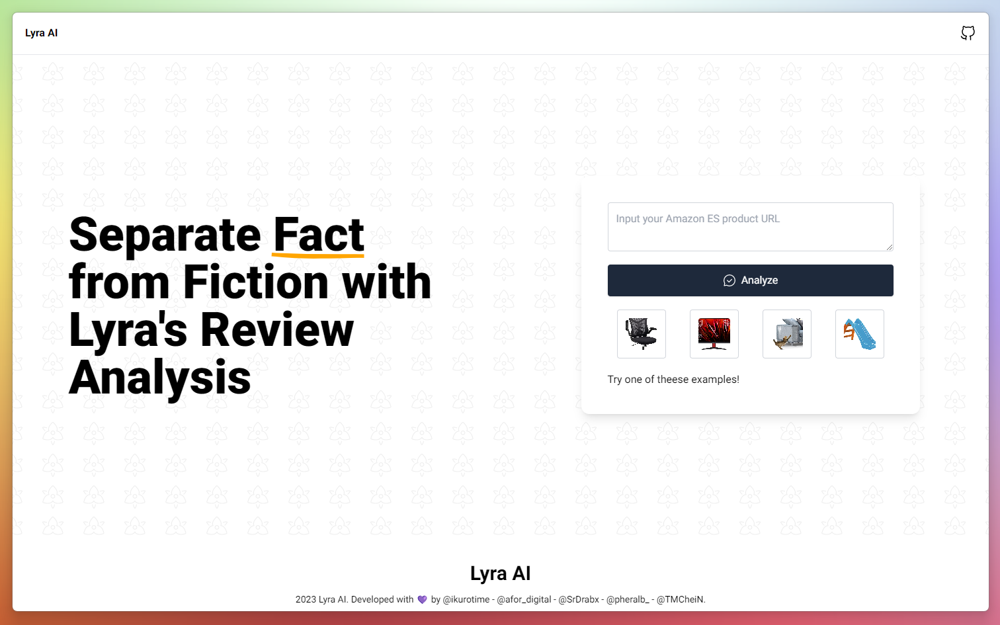

<div align="center">

<a href="https://lyrai.fly.dev">

</a>

<p></p>

<a href="https://lyrai.fly.dev">Explore</a>
<span>&nbsp;&nbsp;❖&nbsp;&nbsp;</span>
<a href="#-getting-started">Getting Started</a>
<span>&nbsp;&nbsp;❖&nbsp;&nbsp;</span>
<a href="#-team">Team</a>
<span>&nbsp;&nbsp;❖&nbsp;&nbsp;</span>
<a href="#%EF%B8%8F-deploy">Deploy</a>
<span>&nbsp;&nbsp;❖&nbsp;&nbsp;</span>
<a href="https://midu.dev/">midudev Hackathon</a>


</div>

## 👋 Team

- [**@srdrabx**](https://github.com/nachoaldamav) - Nacho Aldama.
- [**@pheralb**](https://github.com/pheralb) - Pablo Hdez.
- [**@afor_digital**](https://github.com/aforina) - Sara Montagud.
- [**@ikurotime**](https://github.com/ikurotime) - David Huertas.
- [**@tmchein**](https://github.com/tmchein) - Juan Rojas.

## 🛠️ Stack

This is a **Turborepo** project with:

- [**Cohere**](https://cohere.ai/) - Making NLP part of every developer's toolkit.
- [**Next.js 13 with /app folder + Typescript**](https://nextjs.org/) - The React Framework.
- [**Tailwind CSS + clsx**](https://tailwindcss.com/) - A utility-first CSS framework for rapidly building custom designs.
- [**Prettier + prettier-plugin-tailwindcss**](https://prettier.io/) - A Prettier plugin for sorting Tailwind CSS classes.
- [**HeadlessUI**](https://headlessui.dev/) - unstyled, fully accessible UI components.
- [**Iconoir** icons](https://iconoir.com/) - A set of 1000+ free MIT-licensed high-quality SVG icons for you to use in your web projects.
- [**Playwright**](https://playwright.dev/) - Node library to automate Chromium, Firefox and WebKit with a single API.
- [**Zod**](https://zod.dev/) - TypeScript-first schema validation.

## 🚀 Getting Started

1. Clone or fork this repository:

```bash
git@github.com:MiduTeam/lyra-ai.git
```

2. Install dependencies with your favorite package manager:

```bash
npm i
# or
yarn install
# or
pnpm install
# or
ultra install
```

3. Create a **.env** file in the root of the project and add the following variables:

```bash
COHERE_KEY=
```

4. Run the development server:

```bash
npm run dev
# or
yarn dev
# or
pnpm run dev
# or
ultra dev
```

✨ Open [http://localhost:3000](http://localhost:3000) with your browser to see the result.

## 📦 Api Routes

- **Check**: `src/pages/api`

| --  | Type   | Url                        | Description             | Params                | Info                                               |
| --- | ------ | -------------------------- | ----------------------- | --------------------- | -------------------------------------------------- |
| ⚙️  | `GET`  | `/api/scrapper/`           | Scrap Amazon website    | `url`                 | 🛠️ Only [encoded](https://www.urlencoder.org/) url |
| ⚙️  | `GET`  | `/api/get-screen/`         | Get screenshot          | `url`                 | -                                                  |
| ⚙️  | `POST` | `/api/get-classification/` | Get classification list | `product`, `category` | -                                                  |

## ⭐ Contributing

<a href="https://github.com/miduteam/lyra-ai/graphs/contributors">
  
</a>

<p></p>

## ☁️ Deploy:

- Frontend on **Fly**: [https://lyrai.fly.dev](https://lyrai.fly.dev).
- Backend on **Railway**: [https://lyra-api.up.railway.app/](https://lyra-api.up.railway.app).